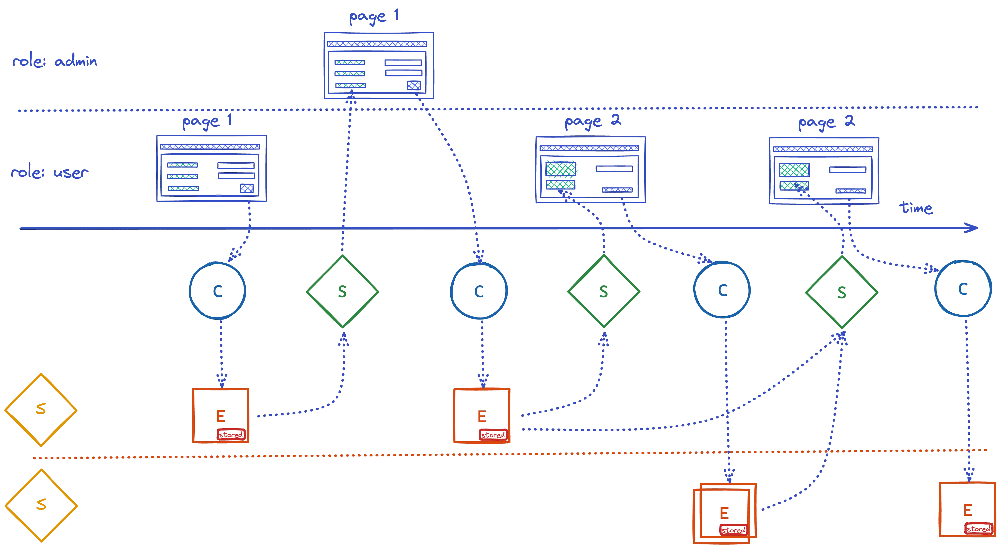

# Heapcon WarmUp MeetUp - 16 October 2025


## Data & Behaviour = Information (Algebra of the Business)

- Data (`examples/api.kt`): Commands, Events, State
- Behaviour (`examples/domain.kt`): Exhaustive pattern matching on data

## Overview

This project encodes information systems as composable algebraic structures using pure Kotlin functions.

It unifies two classical architectural styles:

- 🏛️ State-stored systems — store current state directly
- 🌀 Event-sourced systems — store past events and reconstruct state from them

Both are captured under a single algebraic model — the `System` type.

```
decide       : Command × State → Sequence<Event>
evolve       : State × Event   → State
initialState : ()              → State
```
```kotlin
data class System<Command, State, Event>(
    val decide: (Command, State) -> Sequence<Event>,
    val evolve: (State, Event) -> State,
    val initialState: () -> State
)

```

Convert between representations easily:
```
val system: System<C, S, E> = ...

val stateStored: StateStoredSystem<C, S> = system.asStateStoredSystem()
val eventSourced: EventSourcedSystem<C, E> = system.asEventSourcedSystem()

```

### Algebraic View

| Concept       | Mathematical Structure    | Notes                                                |
| ------------- | ------------------------- | ---------------------------------------------------- |
| `mapCommand`  | **Contravariant Functor** | Maps input command types                             |
| `mapEvent`    | **Profunctor (dimap)**    | Contravariant in input events, covariant in output   |
| `mapState`    | **Profunctor (dimap)**    | Contravariant in input state, covariant in output    |
| `combine`     | **Monoidal Product**      | Combines two systems into a product system           |
| `emptySystem` | **Monoidal Identity**     | Represents the “no-op” system (`System<Nothing?, Unit, Nothing?>`) |


## 📚 Learn More - [fmodel.fraktalio.com](fmodel.fraktalio.com)


