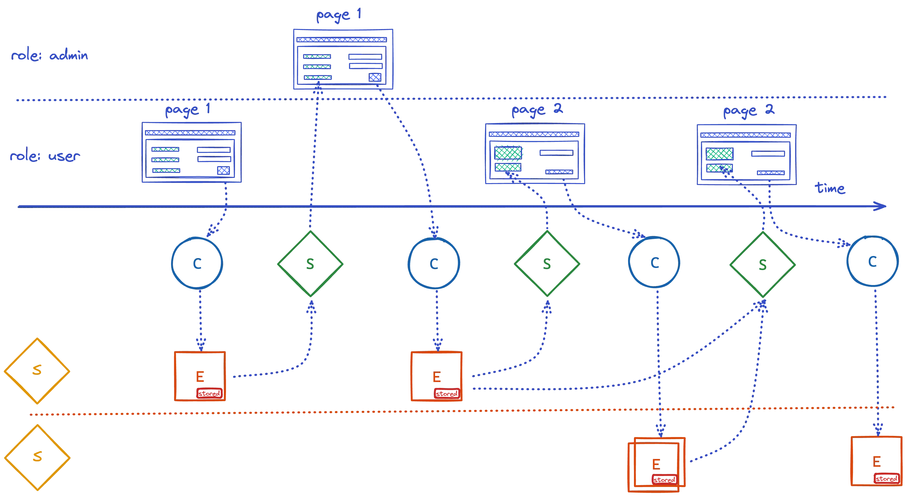

# Information Systems in Kotlin


Information systems as composable algebraic structures. Unifies state-stored (🏛️ store current state) and
event-sourced (🌀 store past events) architectures under a single model.

## The Journey: From General to Specific

The library is structured as a progression from the most general abstraction to practical implementations. Each file
builds upon the previous one through specialization:

### 1. GeneralSystem (5 type parameters)

`src/1_GeneralSystem.kt` — The foundation

The most general form that captures all possible information systems:

```kotlin
interface IGeneralSystem<Command, InState, OutState, InEvent, OutEvent> {
    val decide: (Command, InState) -> Sequence<OutEvent>
    val evolve: (InState, InEvent) -> OutState
    val initialState: () -> OutState
}
```

This abstraction allows:

- Different input/output state types (InState ≠ OutState)
- Different input/output event types (InEvent ≠ OutEvent)
- Full functorial and profunctor transformations
- Monoidal composition via `combine`

### 2. DynamicSystem (4 type parameters)

`src/2_DynamicSystem.kt` — First specialization

Constrains state types to be equal: `InState == OutState == State`

```kotlin
interface IDynamicSystem<Command, State, InEvent, OutEvent> :
    IGeneralSystem<Command, State, State, InEvent, OutEvent>
```

This enables:

- Event-sourced systems (events can differ: InEvent ≠ OutEvent)
- State reconstruction from event sequences
- Conversion to `EventSourcedSystem` type alias

### 3. System (3 type parameters)

`src/3_System.kt` — Second specialization

Further constrains event types to be equal: `InEvent == OutEvent == Event`

```kotlin
interface ISystem<Command, State, Event> :
    IDynamicSystem<Command, State, Event, Event>
```

This is the most common form, enabling:

- Both state-stored and event-sourced architectures
- Conversion to `StateStoredSystem` type alias
- Conversion to `EventSourcedSystem` type alias (limited to InEvent == OutEvent)
- Full bidirectional system representation

Note: The constraint `InEvent == OutEvent` means this system can only handle event-sourced scenarios where the events
you read are the same type as the events you produce. For more flexible event transformations (InEvent ≠ OutEvent), use
`DynamicSystem` instead.

### 4. StatefulSystem (Persistence layer)

`src/4_StatefulSystem.kt` — Practical implementation

Adds repository interfaces for persistence:

```kotlin
interface IStateRepository<Command, State> {
    suspend fun fetchState(command: Command): State?
    suspend fun save(state: State): State
    suspend fun process(command: Command, system: StateStoredSystem<Command, State>): State
}

interface IEventRepository<Command, InEvent, OutEvent> {
    suspend fun fetchEvents(command: Command): Sequence<InEvent>
    suspend fun save(events: Sequence<OutEvent>): Sequence<OutEvent>
    suspend fun process(command: Command, system: EventSourcedSystem<Command, InEvent, OutEvent>): Sequence<OutEvent>
}
```

This provides:

- Separation of domain logic from persistence
- Transactional semantics (fetch → compute → save)
- Convenient `handle` extension functions

## Algebraic View

| Concept       | Mathematical Structure    | Notes                                                                     |
|---------------|---------------------------|---------------------------------------------------------------------------|
| `mapCommand`  | **Contravariant Functor** | Maps input command types                                                  |
| `mapEvent`    | **Profunctor (dimap)**    | Contravariant in input events, covariant in output                        |
| `mapState`    | **Profunctor (dimap)**    | Contravariant in input state, covariant in output                         |
| `combine`     | **Monoidal Product**      | Combines two systems into a product system                                |
| `emptySystem` | **Monoidal Identity**     | Represents the "no-op" system (`GeneralSystem<Nothing?, Unit, Nothing?>`) |

## Data & Behaviour = Information (Algebra of the Business)

- Data (`examples/api.kt`): Commands, Events, State
- Behaviour (`examples/domain.kt`): Exhaustive pattern matching on data

## 📚 Learn More - [fmodel.fraktalio.com](fmodel.fraktalio.com)


